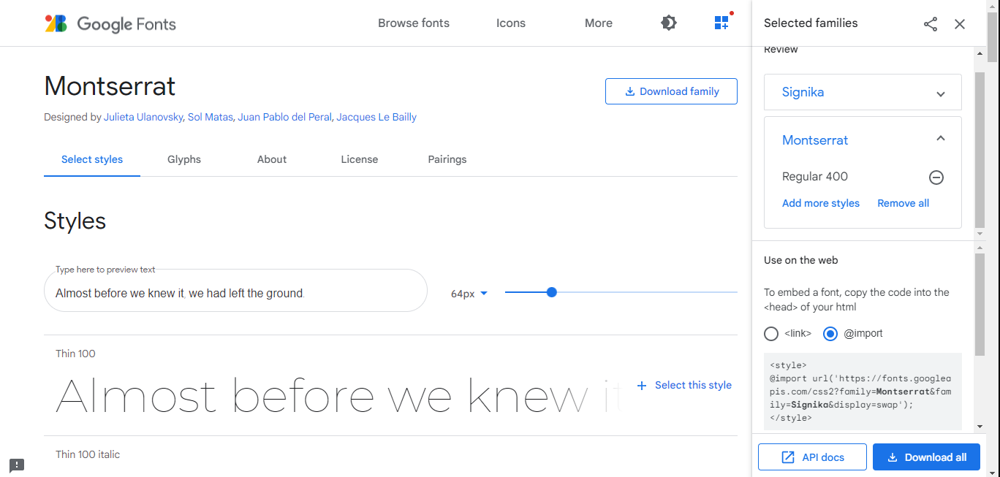
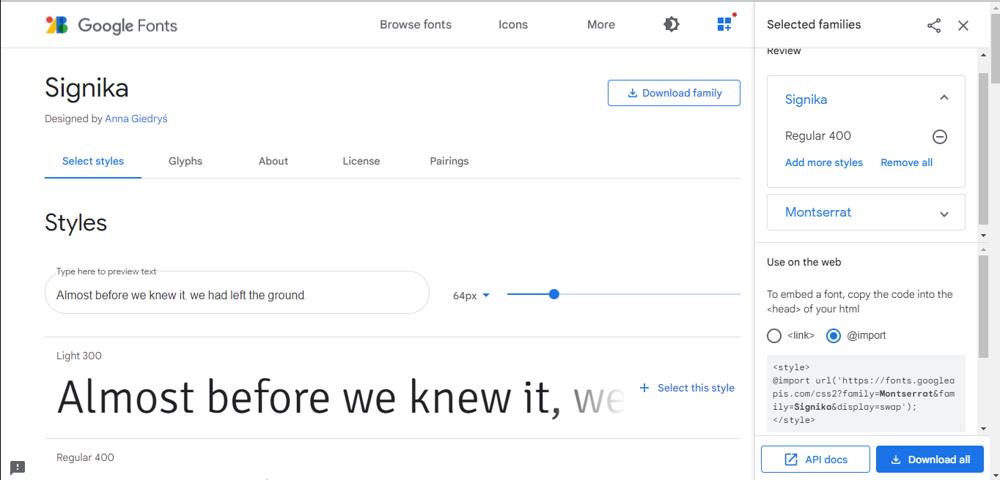

 Estética {#estetica}

Elementos estéticos são modificados em arquivos CSS que ficam dentro da pasta *assets*. Estes arquivos devem estar linkados no arquivo `_output.yml`

Imagens ficam armazenadas dentro da pasta *image*.


##  Sumário (Table Of Contents - TOC)

### Inserir imagem acima/abaixo do sumário

Para inserir uma imagem acima do sumário, no arquivo `_output.yml`, na seção config -> toc -> before, inserir o seguinte código em html: 

`<li class="toc-logo"><a href="./"></a></li>`

A classe `"toc-logo"` é estilizada no arquivo css


Para inserir uma imagem abaixo do sumário, apenas alterar para a seção config -> toc -> after


As configurações desta imagem devem ser feitas no arquivo toc.css


```r
/*--- LOGO ---*/

.toc-logo {
  width: 100px !important;
  object-fit: contain;
  margin: 0 auto;
  display: block;
}

.toc-logo img {
  max-width: 100%;
  margin-bottom: 10px;
}

.summary > li:first-child {
  height: auto !important;
}
```


Para ajustar o tamanho da imagem, modifique o argumento `width`.


### Mudar a cor de fundo do sumário

No arquivo css. inserir o seguinte código:

```r
/*------------ TOC color--------------*/
.book .book-summary {
  background: #e8e8e8;
  border-right: none;
}
```

### Estilizando os links do Sumário

Para alterar a fonte:

```r
/*------------ TOC font--------------*/
.summary{
font-family: 'Signika ', sans-serif;
}
```

Para alterar a cor da fonte: 

```r
.book .book-summary ul.summary li a,
.book .book-summary ul.summary li span {
  padding-top: 8px;
  padding-bottom: 8px;
  padding-left: 15px;
  padding-right: 15px;
  color: #30326e;
}
```


Para uma cor diferente quando o link é apontado:

```r
.summary a:hover {
  color: ##335aa1 !important;
}
```

Alterar a cor para o link ativo:

```r
.book .book-summary ul.summary li.active>a { /*active TOC links*/
  color: #ad366e !important;
  border-left: solid 4px;
  border-color: #5699cc;
  padding-left: 11px !important;
}
```


## Imagem *Hero*

Uma image hero é uma imagem larga que ocupa toda a largura da página. 

Inicialmente, deve-se ser criado um arquivo HTML onde será inserido o seguinte código:

```r
<link href="style.css" rel="stylesheet">
<div class="hero-image-container"> 
  /image/books.png">
</div>

```

Este arquivo deve ser linkado em `_output.yml` na seção includes -> before_body

HACK: para copiar a imagem para a versão final, precisei adicionar a imagem "oculta" (tamanho zero) com o seguinte código:

```r
{width=0%}
```

{width=0%}


No arquivo css, a imagem deve ser configurada com o seguinte código:

```r
/*---------------Hero Image------------------*/

.hero-image-container {
  position: absolute;
  top: 0;
  left: 0;
  right: 0;
  height: 390px;
  /*background-image: url("image/books.jpg");*/
  background-color: #3fb5bd;
}

.hero-image {
  width: 100%;
  height: 390px;
  object-fit: cover;
}

.page-inner {
  padding-top: 440px !important;
}
```


## Texto

### Fontes

Para mudar a aparência do texto com uma nova fonte, você precisa selecionar e importar as fontes em https://fonts.google.com/ e estilizar um texto específico que será formatado com cada uma das fontes.

#### Selecionando e importando do Google fonts

Acessando https://fonts.google.com/ você poderá selecionar suas fontes preferidas entre milhares disponíveis. 

:::recom
É recomendável utilizar uma fonte *sans-serif* (sem serifas, ou seja, sem aqueles pequenos traços no fim das letras) para o texto principal por ser de mais fácil leitura em telas menores (smartphones).
:::

Neste exemplo, eu escolhi a fonte `Montserrat Regular 400` (Figura \@ref(fig:gfont1)) para o texto principal e a fonte `Signika Regular 400` (Figura \@ref(fig:gfont2)) para os títulos das seções.

```{r gfont1, echo=FALSE, fig.cap="Seleção da fonte `Montserrat Regular 400`."}

```

```{r gfont2, echo=FALSE, fig.cap="Seleção da fonte `Signika Regular 400`."}

```

Para importar estas fontes, copie o código gerado em `@import` (veja exemplo abaixo) e cole no arquivo *css*.

```r
/* importando a fonte do Google */

@import url('https://fonts.googleapis.com/css2?family=Montserrat&family=Signika&display=swap');
```
#### Estilizando o texto

Para alterar a fonte do texto principal, adicone o seguinte código ao arquivo *css*

```r
 /* Texto principal */
.book.font-family-1 {
  font-family: 'Montserrat', sans-serif;
}
```

* `.book.font-family-1` seleciona o texto principal.
* `font-family: 'Montserrat'` indica o nome da fonte a ser utilizada
* `sans-serif` indica ao navegador para usar uma fonte sans-serif padrão em caso de problemas com a fonte importada.


Para alterar a fonte dos cabeçalhos, adicione o seguinte código:

```r
/* Cabeçalhos */
h1, h2, h3, h4 {
  font-family: 'Signika', sans-serif;
}
```

Para o título e subtítulo:

```r
/* Título */
.title {
  font-family: 'Signika';
  font-size: 3em !important;
  color: #e82315;
  margin-top: 0.275em !important;
  margin-bottom: 0.35em !important;
}
/* Subtítulo */
.subtitle {
  font-family: 'Signika';
  color: #917ade;
}
```

Observem que mais características firam alteradas, como a cor das fontes.

### Links

Os links para outros endereços podem ser estilizados, modificando sua aparência normal e quando apontado (*hover*) ou clicado (*visited*). 

```r
/*----- Links -------*/
.book .book-body .page-wrapper .page-inner section.normal a:link{
  color: #67aae0;
}
.book .book-body .page-wrapper .page-inner section.normal a:hover {
color: #1980d4; /* escurecer quando apontado */
background-color: #c4c4c4;
}
.book .book-body .page-wrapper .page-inner section.normal a:visited {
color: #d44e19;
}
```

## Caixas de Texto

As caixas de texto são personalizadas para destacar alguma dica, sugestão ou aviso importante. É possível criar diferentes caixas de textos pra diferentes objetivos.

No arquivo css, inserir o seguinte código:

```r
/* -----------Caixa de texto------------- */
  div.cursor, div.cat {
    padding: 1em;
    margin: 1em 0;
    padding-left: 100px;
    background-size: 70px;
    background-repeat: no-repeat;
    background-position: 15px center;
    min-height: 120px;
    color: #1f5386;
    background-color: #f6ff00;
    border: solid 5px #000000;
  }

div.cursor {
  background-image: url("../image/cursor.png");
}

div.cat {
 background-image: url("../image/cat.png");
}
```

A cor de fundo das caixas de texto pode ser alterada com o argumento `background-color:`, enquanto que a cor do texto é alterada com o argumento `color:`.

A imagem é alterada com o argumento `background-image:`.

Para usar a caixa de texto:

```r
:::cursor
Use a caixa de texto digitando` ::: `seguido do nome atribuído ao estilo (depois da palavra *div*) no arquivo css.
:::

```

:::cursor
Use a caixa de texto digitando` ::: `seguido do nome atribuído ao estilo (depois da palavra *div*) no arquivo css.
:::


## Mix

